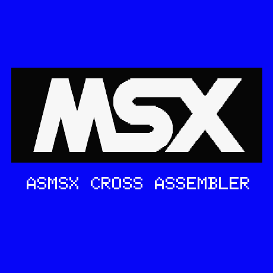

asmsx-cleanup
=============

asmsx is a Z80 cross-assembler for MSX family of 8-bit computers, written
originally by Eduardo Robsy Petrus. Eduardo worked on asmsx for a decade before
he decided to discontinue any further efforts and sold full rights to product
on eBay. cjv99 purchased the rights and released the source code under GPLv3
license: <https://code.google.com/p/asmsx-license-gpl/>.

I started tinkering with asmsx in late 2013. First I've translated Spanish to
English, both the source code and documentation. Next I've started reformatting
and bugfixing the code with the help of warnings from a variety of C compilers.

After a while I've hit the wall on asmsx cleanup project. Making significant
changes to it is risky without a proper test harness, and building test units
is very difficult due to extremely convoluted and interdependent nature of the
source code.

I decided to put asmsx-cleanup project on pause and instead write a new Z80
cross-assembler for MSX from scratch. I'm using Python and PLY, the project is
called saspy: <https://github.com/oboroc/saspy/>.

Adrian Oboroc
May 2, 2014
